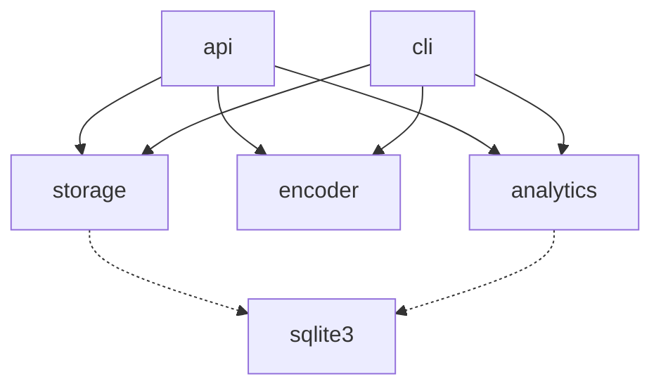

# 架构摘要 — URL 短链服务

一句话概述：5 模块 / 11 接口 / 6 条数据流的本地 URL 短链服务（FastAPI + CLI 双入口，SQLite 存储）。

## 模块依赖图

## 关键数据流（Top 3）

1. **重定向**（4 模块，最复杂）：客户端 → api.redirect_url → encoder.is_valid_code → storage.get_long_url → analytics.record_click → 302
2. **创建短链**：api.shorten_url / cli.main → encoder.encode → storage.save_mapping（冲突重试 3 次 → 409 / 退出码 1）
3. **查询统计**：cli.main → storage.get_long_url → analytics.get_stats → 终端

## 设计决策

- **DECISION_001**：短码用 Base62 随机 6 位——无状态、实现简单，冲突靠重试。
- **DECISION_002**：存储用 SQLite 单文件——零配置，匹配本地服务场景。
- **DECISION_003**：record_click 同步写入——诚实记录现状；异步化列为后续优化。

## 外部依赖与故障模式

- **sqlite3**（单文件库）：连接/SQL 失败 → 异常向上传播（当前未捕获，已知缺口）。

## 回顾

- analytics 与 storage 直连同一 SQLite 库而非经接口访问，是有意的技术选择（免一层转发），
  但违反模块边界精神，规模化时应收敛为 analytics 只调 storage 接口。
- 短码冲突重试循环在 api 与 cli 各实现一次，v2 应收敛到 encoder 或独立模块。
